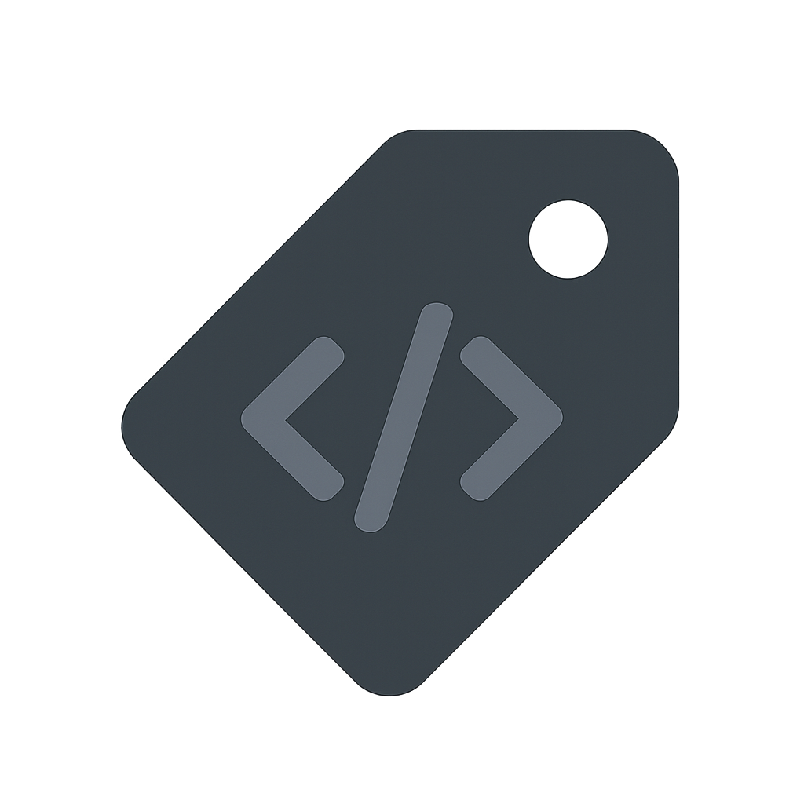

<div align="center"></div>

# <div align="center"> DevBadgeMaker </div>

> 개발자를 위한 기술 스택 뱃지 생성기입니다. >
>
> 이름과 색상을 입력하면 마크다운에서 사용할 수 있는 뱃지를 생성합니다.
>
> 개발 기간ㅣ 25-05-31 ~ 06-04

## ✍️ 사용 방법

1. 기술 스택 이름을 입력합니다 (예: JavaScript, React, Python 등)
2. 뱃지 색상을 입력하거나 색상 선택기를 사용합니다
3. 자동으로 생성된 뱃지를 미리보기로 확인합니다
4. 뱃지 이미지를 클릭하여 마크다운 코드를 복사합니다
5. 복사한 마크다운 코드를 README 파일 등에 붙여넣어 사용합니다

## 기술 스택


## 📂디렉토리 구조

```
dev-badge-maker/
├── README.md
├── images/
│   ├── icon.png
├── script.json
├── index.html
├── style.css
```
